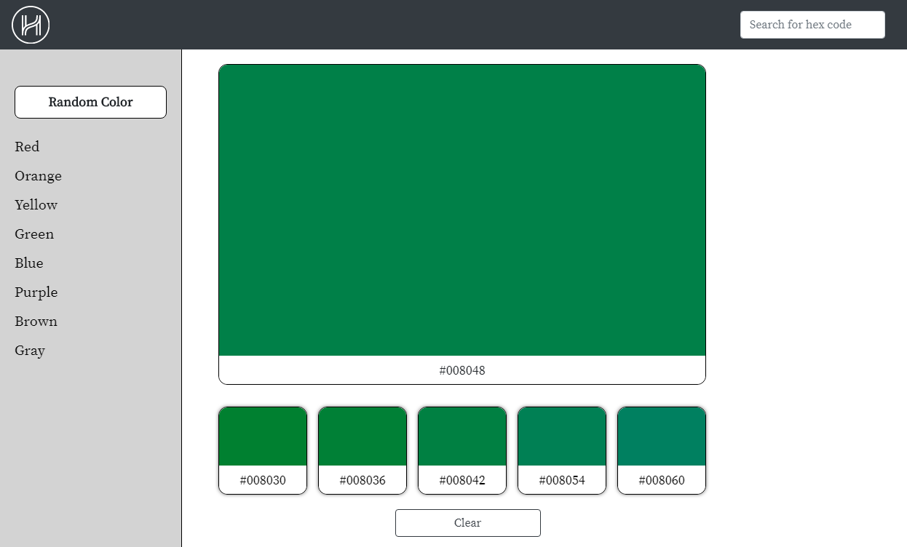
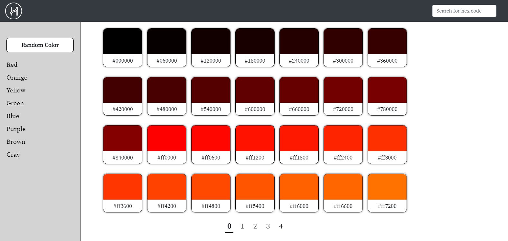

  

# Helpful Human Interview Challenge, Redone with GraphQL
**by Curtis Yungen**

November 2019

### Deliverables

This is my second solution to the <b>Helpful Human Interview Challenge</b>. 

#### I completed the Core, Stretch, and most of the Bonus Stretch objectives.

* Challenge instructions: https://github.com/HelpfulHuman/interview-challenge.
* Project repository (Github): https://github.com/curtisyungen/hh-graphql.
* Deployed solution (Heroku): https://hh-graphql.herokuapp.com.
* First solution (Heroku): https://hh-interview.herokuapp.com.

 

ヽ༼ ຈل͜ຈ༼ ▀̿̿Ĺ̯̿̿▀̿ ̿༽Ɵ͆ل͜Ɵ͆ ༽ﾉ

### Reflection

#### Overall comments:

#### What I liked: 
* I think the interface turned out well.
* I like the pagination.

#### What I'd improve: 
* I need to figure out how to make the <b>first-time load</b> quicker, likely by splitting up the App.js file into smaller ones.
* I'm curious to see <b>a more optimal algorithm</b> for generating non-random hex codes.
* The <b>shade filters</b> aren't perfect. That is, there are some purples grouped as browns, grays grouped in purples, etc.
* I'd better utilize <b>Bootstrap</b> so I can avoid tedious media queries. 
* I looked at some <b>GraphQL</b> tutorials but decided to leave it out for this project. I'm interested in learning more about it though. 

### Technologies
1) Node.js
2) Express.js
3) ReactJS
4) Bootstrap
5) GraphQL

### NPM Dependencies
1) express
2) react-dom
3) react-router-dom
4) react-onclickoutside
5) react-apollo
6) concurrently
7) cors
8) create-react-app
9) express-graphql
10) graphql
11) lodash

### Download Instructions

*Ensure that you have installed a Code Editor such as Visual Studio Code as well as Node.js.
Installation instructions for Node.js can be found here: https://nodejs.org/en/download/*

Run the following commands in your console/terminal:

1) git clone https://github.com/curtisyungen/hh-graphql
2) cd hh-graphql
3) npm install
4) npm run dev

App will run on http://localhost:4000.

### Screenshots

 

 
